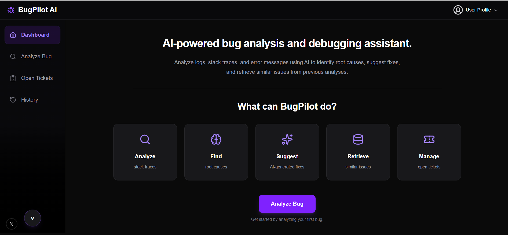
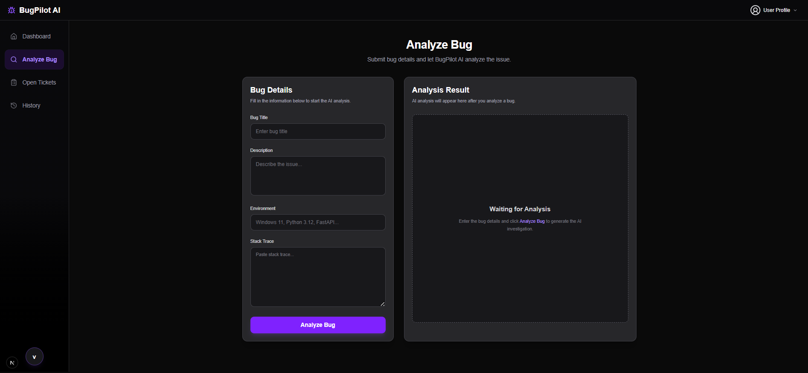
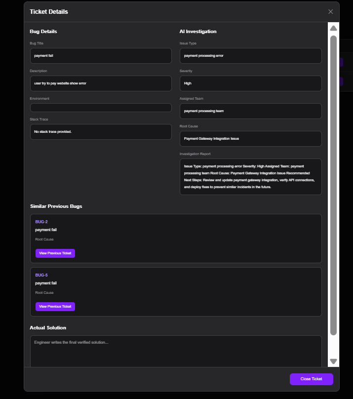
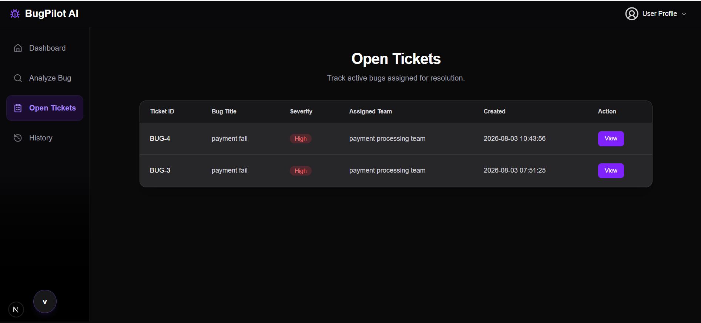
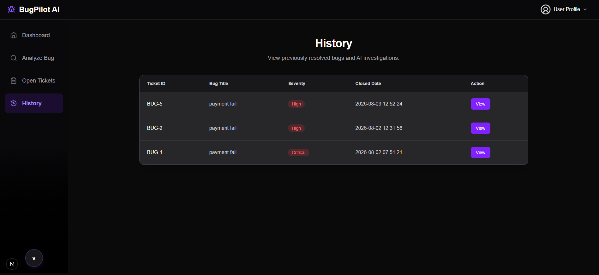
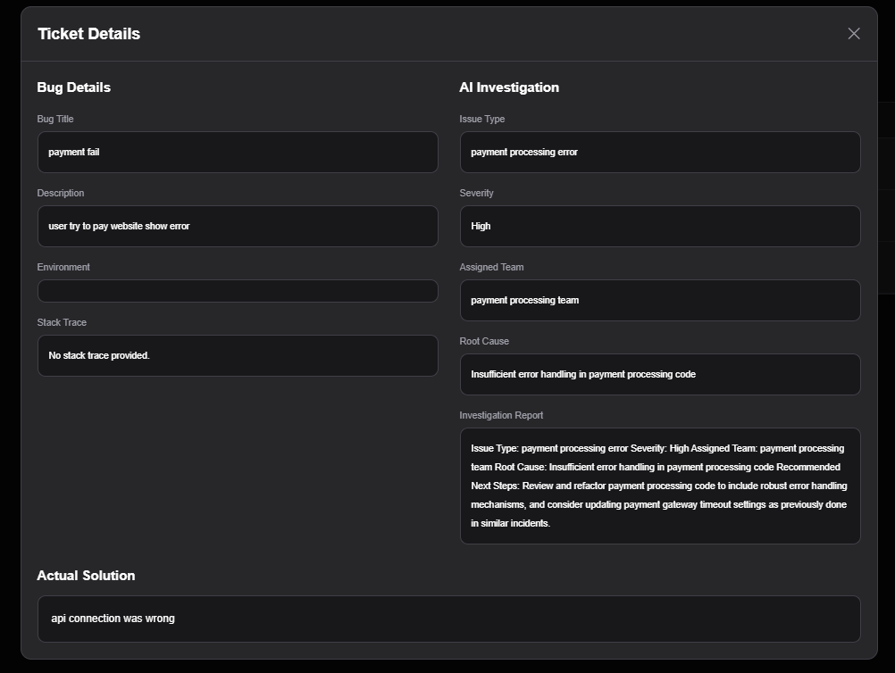

# 🐞 BugPilot AI

BugPilot AI is an AI-powered bug investigation assistant that helps software teams analyze incoming bug reports and learn from previously resolved issues.

When a new bug is reported, the system doesn't rely only on an LLM. It first searches similar historical incidents using Retrieval-Augmented Generation (RAG), then uses that context to generate a structured investigation report containing the issue type, severity, probable root cause and recommended next steps.

The goal of this project is to demonstrate how LLMs, AI agents and RAG can be combined to solve a real software engineering problem.


---


# Why I Built This

During software development, engineers often spend a significant amount of time searching old tickets to understand whether a similar issue has already occurred and how it was fixed.

Traditional ticketing systems store valuable historical knowledge, but finding the right information usually depends on manual keyword searches and personal experience.

I built BugPilot AI to reduce this effort.

Instead of manually searching historical tickets, the application automatically retrieves similar resolved bugs, provides their verified engineer solutions as context, and generates an investigation report that engineers can use as a starting point.


---


# Current Status

BugPilot AI is currently an MVP.

The current version focuses on demonstrating an AI-assisted bug investigation workflow using historical ticket retrieval and structured investigation generation.

Future versions will expand into a complete AI-powered engineering assistant with authentication, integrations, multi-agent workflows, and cloud deployment.


---


# Features

- Analyze software bug reports using AI
- Retrieve similar historical bugs using RAG
- Semantic search using FAISS vector database
- AI-generated investigation reports
- Issue type classification
- Severity prediction
- Engineering team recommendation
- Root cause analysis
- Ticket management dashboard
- Store verified engineer solutions
- Historical tickets continuously improve future investigations


---


# Tech Stack

## Frontend
- Next.js
- React
- TypeScript
- Tailwind CSS

## Backend
- FastAPI
- Python

## AI Stack
- LangGraph
- LangChain
- Groq LLM
- HuggingFace Embeddings
- FAISS

## Database
- Postgresql


# System Architecture

```
                 User
                  │
                  ▼
          Next.js Frontend
                  │
                  ▼
            FastAPI Backend
                  │
                  ▼
          LangGraph Workflow
                  │
      ┌───────────┼───────────┐
      │           │           │
      ▼           ▼           ▼
Classification Root Cause Investigation
    Agent        Agent      Generator
                  │
                  ▼
             RAG Pipeline
                  │
      ┌───────────┴───────────┐
      ▼                       ▼
 HuggingFace             FAISS Vector
  Embeddings               Database
                  │
                  ▼
              Postgresql
```


---


# Workflow

1. User submits a new bug report.

2. The backend receives the request through FastAPI.

3. Previously resolved tickets are loaded from the database.

4. HuggingFace embeddings are generated.

5. FAISS retrieves the most similar historical bugs.

6. Retrieved tickets become the context for the investigation.

7. LangGraph executes the investigation workflow.

8. AI predicts:
- Issue Type
- Severity
- Assigned Team
- Root Cause

9. A structured investigation report is generated.

10. Engineers verify the issue and close the ticket.

11. The verified solution becomes part of the knowledge base for future investigations.


---


# Project Structure

```
BugPilotAI
│
├── app
│   ├── api
│   ├── graph
│   ├── nodes
│   ├── schemas
│   ├── services
│   │   ├── RAG
│   │   └── database_service.py
│   └── state
│
├── frontend
│   ├── app
│   ├── components
│   └── public
│
├── data
│   └── bugpilot.db
│
├── requirements.txt
├── main.py
└── README.md
```


---


# Engineering Decisions

Some implementation decisions made while building BugPilot AI:

- Used Retrieval-Augmented Generation (RAG) instead of relying only on an LLM so previous verified bug resolutions could improve future investigations.
- Structured the AI workflow with LangGraph to separate issue classification, root cause analysis, and investigation report generation into independent steps.
- Used FAISS for semantic similarity search to retrieve related historical bug reports efficiently.
- Stored verified engineer solutions so they could become part of the knowledge base for future investigations.
- Chose FastAPI and Next.js to keep the backend and frontend modular and easy to extend.


---


# Future Improvements

This project is currently an MVP.

Some planned improvements include:

- Multi-agent investigation workflow
- PostgreSQL support
- Docker deployment
- User authentication
- Team workspaces
- Jira integration
- GitHub Issues integration
- Slack notifications
- Email alerts
- Vector database (pgvector)
- Cloud deployment
- Analytics dashboard


---


# Screenshots

## Dashboard



---

## Analyze Page



---

## Analyze Ticket



---

## Ticket Page



---

## History Page



---

## History Ticket




---


# Getting Started

## Clone the repository

```bash
git clone https://github.com/vishal8248/bugpilot-ai.git

cd bugpilot-ai
```

## Backend

Create a virtual environment.

```bash
python -m venv .venv
```

Activate it.

Windows

```bash
.venv\Scripts\activate
```

Install dependencies.

```bash
pip install -r requirements.txt
```

Start FastAPI.

```bash
uvicorn main:app --reload
```


---


## Frontend

```bash
cd frontend

npm install

npm run dev
```


---


# Environment Variables

Backend
```
GROQ_API_KEY=your_groq_api_key
```

Frontend
```
NEXT_PUBLIC_API_URL=http://127.0.0.1:8000
```


---


# About Me

**Vishal Mali**.

I'm an aspiring AI Engineer with a strong interest in Generative AI, AI Agents and Retrieval-Augmented Generation (RAG).

I enjoy building practical AI applications that solve real engineering problems while learning modern AI frameworks and system design.

GitHub:
https://github.com/vishal8248


---


# License

This project is licensed under the MIT License.
